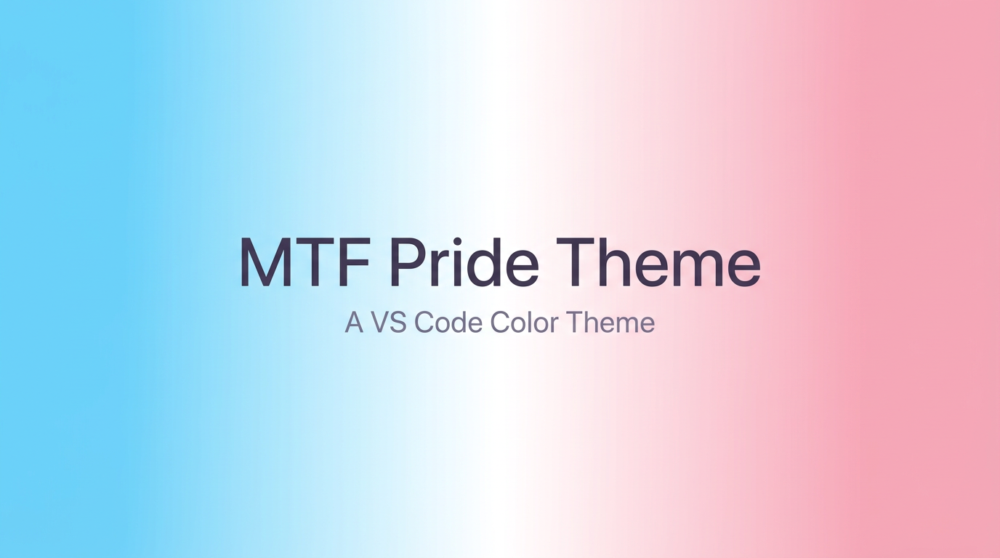

<p align="center">
  
</p>

# MTF Pride Theme for VS Code

A beautiful light color theme for Visual Studio Code, inspired by the **transgender pride flag** — light blue, pink, and white.

## Color Palette

| Role | Color | Hex |
|------|-------|-----|
| Background |  | `#FAFAFF` |
| Foreground |  | `#3B3252` |
| Blue (functions) |  | `#1A8FB5` |
| Pink (keywords) |  | `#D1568C` |
| Lavender (types) |  | `#7C4DBA` |
| Rose (strings) |  | `#9E5580` |
| Amber (constants) |  | `#C47A20` |
| Steel (operators) |  | `#4A80B0` |

## Installation

### From Source (GitHub)

```bash
# 1. Clone the repository
git clone https://github.com/yunlong10/mtf-pride-vscode-theme.git
cd mtf-pride-vscode-theme

# 2. Install the packaging tool (if not already installed)
npm install -g @vscode/vsce

# 3. Package the theme
vsce package

# 4. Install the generated .vsix file
#    Open VS Code / Cursor → Cmd+Shift+P → "Extensions: Install from VSIX"
#    Select the generated mtf-pride-vscode-theme-0.0.1.vsix file
```

After installation, press `Cmd+Shift+P`, type **Color Theme**, and select **MTF Pride**.

### From VSIX (Release)

1. Download the `.vsix` file from [Releases](https://github.com/yunlong10/mtf-pride-vscode-theme/releases)
2. Open VS Code / Cursor
3. Press `Cmd+Shift+P` → **Extensions: Install from VSIX**
4. Select the downloaded `.vsix` file
5. Press `Cmd+Shift+P` → **Color Theme** → select **MTF Pride**

## Development

```bash
git clone https://github.com/yunlong10/mtf-pride-vscode-theme.git
cd mtf-pride-vscode-theme
code .
# Press F5 to launch Extension Development Host and preview the theme
```

## License

[MIT](LICENSE)
